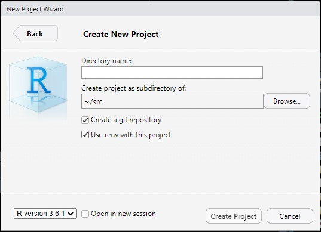

## What is pexlib and why should I use it?

Pexlib is a python library that interfaces [Osisoft PI Web API](https://docs.osisoft.com/bundle/pi-web-api-reference/page/help.html). It really simplifies
querying PI tags over long period of time. Keep in mind though that pexlib is meant to be a massive
extractor. Another initiative based on pexlib is ongoing in Brisbane AU to make it a stream
extractor but we won't address that subject in this document.

Unless you are at ease with Osisoft PI Web APIs, doing raw HTTP requests in R and transforming JSON
structures into R dataframes then pexlib is for you. Two easy to use methods are at your disposal:

1) extractdf
2) extract_dataframe

Both return a pandas dataframe. One has all arguments required to connect to the server and do a
one shot extraction of one tag. The other expect to receive a connection parameter to optimize
multi-tag extractions.

This document assumes that you use RStudio Workbench Pro on a centralized server, not the desktop
version. But yeah you could still use that one if you know what you are doing.

## Lets install some useful libraries
```{r Libraries}
install.packages(c("reticulate", "dplyr"))
library(dplyr)
```


## On how to use pexlib within RStudio Workbench

First create a project with a significative name (File -\> New Project...). When the project name is asked, check the "Create a git repository" and "Use renv with this project" checkboxes.



*Note: While you are at it, why not use R version 4+? Give it a try, really.*

Then in a terminal window (terminal not the R Console) type the following commands:

```{bash}
python3 -m pip venv pyenv
source pyenv/bin/activate
python -m pip install pexlib pandas kerberos
python -m pip freeze > requirements.txt
```

You should have a `.Rprofile` file in your project directory. Open it and make sure to copy the
following content into it:

```{r Rprofile Code}
source("renv/activate.R")
reticulate::use_virtualenv("pyenv", required = T)
```

Install `reticulate`:

```{r Reticulate Installation}
install.packages("reticulate")
```

...and restart your R session.

Now lets create a new R Notebook and add some code

```{r R Notebook Header}
library(reticulate)

reticulate::py_config()
```

Reticulate is a library that bridge the gap between R and python. It allows R programmer to use
python libraries seamlessly. Lets see if you can load `pexlib` into R now.

```{r Loading pexlib}
pexlib <- import("pexlib")

# Just setting some config values do not worry about these lines...
req <- reticulate::import("requests")
req$packages$urllib3$disable_warnings() 
rm(req)
```

## Obfuscation

Before we go, you need to be aware of one thing: password obfuscation. Obfuscated password can not
be easily decoded but it is but still feasible; obfuscation is not encryption. Another user in
another session OR another server cannot de-obfuscate a password created from another user context.
Looking at an obfuscated password gives no clue about the password itself.

This is how to obfuscate a password for pexlib:

```{r Obfuscating a Password}
pexlib$scrambler$obfuscate("password")
```
Another example:

```{r Another Example}
lapply(rep("Janvier2015", 3), function(password) {
  pexlib$scrambler$obfuscate(password)
}) %>% unlist()
```

Just wanted to show you that obfuscating the same string many times produce different results.
This is black magic! At the same time, you have witnessed the use of "lapply", one of the
vectorization functions available in R. Be wise and use vectorization instead of loops.

[EasyCrypt is Not Encryption](https://gist.github.com/formix/4076442db2304fb326a0f30bcbbebff5)

## One Shot Extraction using extractdf

`extractdf` have an exhaustive list of parameters:

```
def extractdf(
        server: str,                                # The Pi Web API server address
        username: str,                              # Your username ex: CORP\\john.doe
        password: str,                              # Your password, can be obfuscated!
        path: str,                                  # The desired tag path
        start_time,                                 # ISO date time string
        end_time,                                   # ISO date time string
        sync_time,                                  # ISO date time string
        interval: str = "5s",                       # number foollowed by "s", "m", "h", "d" or "w"
        output_server: bool = False,                # If true add the server name column 
        drop_duplicates: bool = False,              # Some compression
        stream: str = "Interpolated",               # "Interpolated", "Recorded", "Summary"
        summary_type: str = "Average",              # if stream is "Summary": "Total", "Average", "Minimum", "Maximum", "StdDev", "PopulationStdDev", "Count", "PercentGood"
        batch_size: int = 150_000,                  # Don't play with this one
        ignore_creation_date: bool = False,         # May be handy in some cases (central PI)
        include_bad_values: bool = True):           # Remove what PI API calls bad values
```


```{r}
df <- pexlib$extractor$extractdf(
  "https://casagszwebpi1.corp.riotinto.org/piwebapi/",
  "CORP\\crda.courtoisie",
  "#:f+oxwF2Ti5RypUlg",
  "//JONQPI01/sinusoid",
  start_time = "2021-02-03 15:00:00",
  end_time   = "2021-02-04 03:00:00",
  sync_time  = "2021-02-03 15:00:00",
  interval   = "1m",
  stream     = "Summary",
  summary_type = "Average"
)
head(df)
```

It fails right? Do you recall what we said in the [Obfuscation](#obfuscation) section?
Obfuscation is specific to the current user environment. Try it again but before you do, copy the
obfuscated password from the multiple obfuscation example above.

Now did it work? If yes, you should have a nice dataframe with data coming from PI. Don't forget to
change the obfuscated password in the next example as well.

## Multi-tags Extraction Example

```{r Multi-tags}
client = pexlib$Client(
  "https://casagszwebpi1.corp.riotinto.org/piwebapi/",
  "CORP\\crda.courtoisie",
  "#:3EmSY/4wKDfRBurD"                # Change me!
)

client$open()

tags <- c("//JONQPI01/410F142.PV", "//JONQPI01/BHB-WC-054.PV", "//JONQPI01/BO-DI-804.PV")
df2 <- lapply(tags, function(tag) {
  pexlib$extractor$extract_dataframe(client, tag,
    start_time = "2021-02-03 15:00:00-05:00",
    end_time   = "2021-02-04 03:00:00-05:00",
    sync_time  = "2021-02-03 15:00:00-05:00",
    interval   = "1m",
    stream     = "Recorded")
}) %>% bind_rows()

client$close()

attr(df2$ts, "tzone") <- "America/Toronto"  

df2 %>% 
  group_by(tag) %>%
  summarise(from=min(ts), to=max(ts), count=n(), avg=mean(numval), stddev=sd(numval))
```

## Date and Time Disambiguation ##

Dealing with datetime can become confusing quickly. To disambiguate the situation, always provide
the ISO-8601 time shift when passing datetime parameters to `pexlib`, then specify the time zone you
want to interpret the `ts` column in the returned dataframe. To know which time zones exist, call
`OlsonNames()` in your R console.

## Conclusion ##

This is basically all you need to know about `pexlib` extraction in R. You can now create your own
projects from the current examples. Be aware though that extracting a lot of data can be a big
burden on production servers and networks. If you need a huge extraction or if your code makes a
lot of small extractions repeatedly, it might be a good idea to consult a friendly data engineer
near you to reduce the burden on our poor production systems.

Always remember that PI is an historian, not a hot database usable for extensive data analysis.

Thanks :)

[Jean-Philippe Gravel, ing. PSEM](mailto:jean-philippe.gravel@riotinto.com)
*Your friendly Data Engineer*

